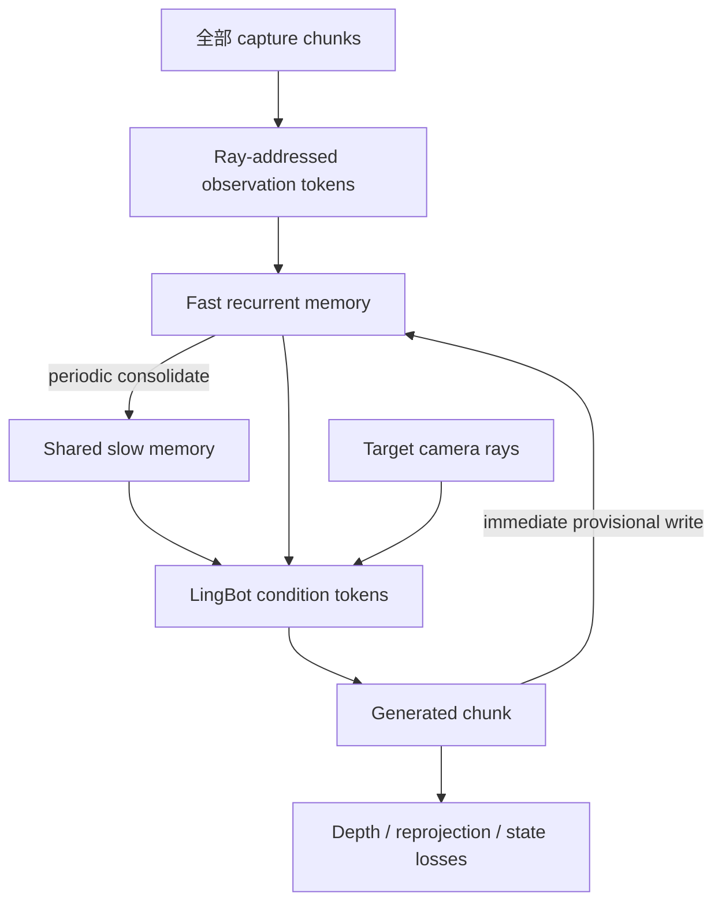

# 长场景训练：可动态更新的 Recurrent Scene Memory

这套代码以 LingBot-Video 为生成 backbone，输入长室内 capture、每帧 SLAM camera pose
和 DAV3 depth，输出一条或多条新 camera trajectory。它不使用 capture-frame retrieval，
也不把点云 rendering 作为生成条件。

## 1. 数据流



`slow_memory_tokens + fast_memory_tokens` 是常数。5000 帧只增加流式 update 次数，不增加
DiT condition 长度。capture 编码完全 target-independent，同一 base state 可供多条轨迹
共享。

## 2. 状态更新协议

代码位于：

- `lingbot_video/long_scene/memory.py`：observation tokenizer、fast/slow writer 和 state；
- `lingbot_video/long_scene/model.py`：LingBot 接入、ray control、在线写回与 rollout；
- `lingbot_video/long_scene/training.py`：flow、memory preservation、state/self-forcing 和 3D loss；
- `lingbot_video/long_scene/data.py`：数据伪接口与 synthetic smoke dataset。

`RecurrentSceneMemoryState` 包含：

```text
slow_tokens       B,S,D
fast_tokens       B,F,D
slow_confidence   B,S
fast_confidence   B,F
steps             B
```

每个 observation token 由 VAE latent feature、世界坐标 Plücker ray、camera pose feature、
source provenance 和 evidence confidence 相加。writer 用 cross/self attention 得到 proposal，
再用 learned delta gate 更新，不直接覆盖旧状态。

### 动态生成写回

训练 forward 会从当前 target 的 velocity prediction 得到 predicted clean latent：

```text
x0_pred = x_sigma - sigma * v_pred
```

它立即以 `GENERATED` 写入当前 trajectory 的 fast state；随后 rollout target 从这个新 state
去噪。`detach_generated_writes=true` 默认截断穿过 `x0_pred` 的二阶生成路径，但 writer 和
future rollout 仍有梯度。clean target 通过同一个 writer 产生 teacher state：

```text
L_state = distance(
    fast_state(write(predicted_x0)),
    stopgrad(fast_state(write(clean_x0)))
)
```

因此模型训练时就看到自己生成的 memory 分布，而不是到推理时第一次遇到。

推理/研究代码可直接调用：

```python
base = model.encode_scene_memory(
    capture_latents=capture_latents,
    capture_c2w=capture_c2w,
    capture_intrinsics=capture_intrinsics,
    capture_valid_mask=capture_valid_mask,
)

branch, diagnostics = model.update_scene_memory(
    base,
    latents=generated_latents.permute(0, 2, 1, 3, 4),
    c2w=generated_c2w,
    intrinsics=generated_intrinsics,
    valid_mask=generated_valid,
    source_type=MemorySource.GENERATED,
    confidence=generated_confidence,
    consolidate=False,
)
```

下一 chunk 使用 `branch`。多条轨迹分别保存自己的 branch；不要让未验证生成覆盖 base。
当多个生成视角经过 depth/visibility 和跨轨迹检查后，使用
`MemorySource.VERIFIED_GENERATED` 并 `consolidate=True` 得到新的共享版本。

## 3. Camera control 与几何

每个 scene 使用固定的 canonical coordinate：

- `scene_center`：完整 capture trajectory 的中心；
- `scene_scale`：完整 trajectory camera radius 的 robust 90% quantile；
- `world_to_scene_rotation`：固定参考相机定义的场景坐标方向。

target latent patch 的 camera ray 经过 Fourier encoding，作为 `video_token_bias` 加到 LingBot
视觉 tokens。它只表达“从哪里、向哪里看”，不渲染这条 ray 应该看到的 RGB。

`RayQueryableGeometryHead` 仅在训练时从 memory 预测 target-ray log depth 和可选
DAV3/VGGT feature。DAV3 depth 还用于同轨迹/跨轨迹 inverse warp；source-depth z-test
过滤遮挡与反遮挡。推理不需要该 head。

## 4. 损失

```text
L = λflow   L_flow
  + λroll   L_future_rollout
  + λstate  L_generated_write_state
  + λmem    L_history_reconstruction
  + λdepth  L_query_depth
  + λfeat   L_geometry_feature
  + λreproj L_reprojection
  + λpair   L_cross_trajectory
```

- `L_flow`：当前 target chunk 的 LingBot rectified-flow loss；
- `L_future_rollout`：读取 predicted generated memory 后的未来 chunk flow loss；
- `L_generated_write_state`：predicted write 与 clean write 的 fast-state consistency；
- `L_history_reconstruction`：按随机 capture rays 从最终 memory 重建过去 VAE latent；
- `L_query_depth`：任意 target rays 查询 depth，包含 scale-invariant 与 metric-scale 项；
- `L_geometry_feature`：可选 DAV3/VGGT patch feature 对齐；
- `L_reprojection`：同轨迹回环的 occlusion-aware latent correspondence；
- `L_cross_trajectory`：两个从同一 base state fork 的输出轨迹在共同表面的 correspondence。

高噪 timestep 的 `x0` 不稳定，reprojection 由 `geometry_loss_max_sigma` 门控。generated
write confidence 使用 `(1-sigma)^2`，known clean prefix 的 confidence 为 1。

## 5. Batch 伪接口

intrinsics 必须按图像宽高归一化：

```text
fx <- fx / W, cx <- cx / W
fy <- fy / H, cy <- cy / H
```

所有 pose/depth 必须对齐 VAE latent 时间轴。若 RGB 时间压缩率为 4，使用对应 RGB 索引的
pose；旋转应在 SE(3)/quaternion 上插值，不能直接平均矩阵。DAV3 depth 必须先对齐 SLAM
translation scale。

基础字段：

| 字段 | shape | 说明 |
| --- | --- | --- |
| `capture_latents` | `B,N,C,H,W` | 按 capture 顺序排列；N 可到 5000 latent frames |
| `capture_c2w` | `B,N,4,4` | capture pose |
| `capture_intrinsics` | `B,N,3,3` | 归一化内参 |
| `capture_valid_mask` | `B,N` | padding mask |
| `scene_center` | `B,3` | 真实训练推荐预计算 |
| `scene_scale` | `B` | 真实训练推荐预计算 |
| `world_to_scene_rotation` | `B,3,3` | 所有 chunk/trajectory 共用 |
| `target_latents` | `B,C,T,H,W` | 当前 clean target chunk |
| `target_c2w` | `B,T,4,4` | latent-time target poses |
| `target_intrinsics` | `B,T,3,3` | latent-time intrinsics |
| `target_depth` | `B,T,Hd,Wd` | 与 SLAM 同尺度的 DAV3 depth |
| `target_depth_confidence` | `B,T,Hd,Wd` | 可选 |
| `known_prefix_mask` | `B,1,T,1,1` | clean/student prefix 位置 |
| `prefix_condition_latents` | `B,C,T,H,W` | 可选 student rollout prefix |
| `target_write_valid_mask` | `B,T` | 哪些生成帧允许写入 fast state |
| `prompt_embeds` | `B,L,text_dim` | 预计算 LingBot condition |
| `prompt_attention_mask` | `B,L` | condition mask |
| `consistency_pairs` | `B,P,2` | 同轨迹回环/重叠 pairs |

动态 rollout 额外字段：

```text
rollout_target_latents
rollout_target_c2w
rollout_target_intrinsics
rollout_known_prefix_mask
rollout_prefix_condition_latents
```

双轨迹训练额外字段：

```text
paired_target_latents
paired_target_c2w
paired_target_intrinsics
paired_target_depth
paired_target_depth_confidence
paired_known_prefix_mask
paired_prefix_condition_latents
cross_trajectory_pairs
cross_trajectory_pair_valid_mask
```

数据接口仍为 `module:function`，函数接收 JSON dict 并返回 `torch.utils.data.Dataset`。

## 6. 训练策略

推荐四阶段：

1. **Memory preservation pretrain**：冻结 LingBot，随机截取长短 capture stream，主要训练
   `L_history_reconstruction + L_query_depth`；必须混合 100/500/1000/5000 帧。
2. **Capture → target**：加入 flow、ray camera control、单轨迹回环；打开 LingBot attention LoRA。
3. **Generated write → future rollout**：加入连续 target/rollout chunks，逐步把 memory write
   从 clean latent 切换为 predicted latent，训练 state consistency/self-forcing。
4. **Multi-trajectory commit**：同一 base state 分叉两条轨迹，加入跨轨迹 pairs；训练
   generated evidence 的 verification/commit policy。

长序列样本必须包含 revisit-dense、回环、反向穿行、大 baseline、门洞与强遮挡。普通单向
room tour 即使总时长很大，也不会自动教会模型如何保持长期一致。

smoke test：

```bash
accelerate launch scripts/train_long_scene.py \
  --tiny_smoke_model \
  --synthetic_smoke_data \
  --config configs/long_scene_tiny_smoke.json \
  --output_dir outputs/recurrent_memory_smoke \
  --mixed_precision no \
  --lora_rank 0 \
  --batch_size 1 \
  --num_workers 0 \
  --max_steps 2
```

Dense 1.3B：

```bash
accelerate launch scripts/train_long_scene.py \
  --model_dir "$MODEL_DIR" \
  --config configs/long_scene_dense_1_3b.json \
  --dataset_factory my_data.long_scene:build_dataset \
  --dataset_config configs/my_roomtour_data.json \
  --output_dir outputs/recurrent_scene_memory_dense_1_3b \
  --mixed_precision bf16 \
  --gradient_checkpointing \
  --lora_rank 32 \
  --lora_alpha 32 \
  --batch_size 1 \
  --gradient_accumulation_steps 8 \
  --max_steps 30000
```

`truncate_memory_bptt_every` 控制 capture encoder 的截断反传间隔；它不改变推理状态。
阶段切换用 `--init_from`，同阶段中断恢复用 `--resume`。

## 7. 评估与 3DGS lift

至少报告：

1. memory preservation：按历史年龄分桶的 latent/LPIPS reconstruction；
2. camera controllability：重新估 pose 后的 translation/rotation RPE；
3. 回环与跨轨迹：共同可见表面的 RGB/latent/depth reprojection；
4. error propagation：允许/禁止 generated write 时，100/500/1000/5000 帧退化曲线；
5. 3DGS liftability：用所有生成轨迹和指定 poses 拟合一个 3DGS，在 withheld generated
   views 与原始 capture views 上测 PSNR/SSIM/LPIPS、depth/normal consistency；
6. branch contamination：一条轨迹中的错误是否影响从同一 base fork 的另一条轨迹。

最终目标不是每个局部 clip 单独漂亮，而是所有生成帧能被一个共同 3D scene explanation
同时解释。
